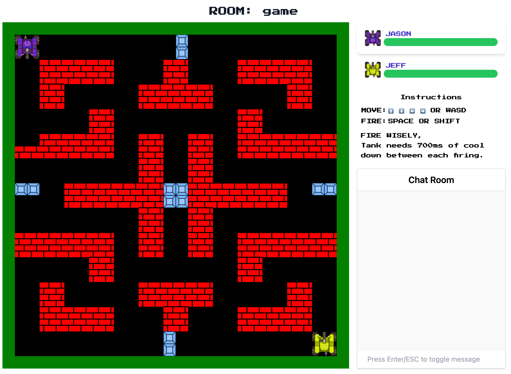

# Multi-player Tanks Game built with Elixir/Phoenix

## Live at [tanks.jjpro.me](https://tanks.jjpro.me)

## Docker

https://hub.docker.com/repository/docker/jjpro/tanks

## Dev Design Notes

Notes for myself during dev: [Design Notes](./DESIGN.md).

## Description

The GAME is a multi-player online tank game with a builtin chat room.
It is an exciting game that requires 2 to 4 players to play.
Users can either create a new game room, or join others.

A new game room is created by clicking the "Create New Room" button at the top of the page.
Created rooms will be listed as cards on the home page,
and any user can click a card to join that specific game.

When user enters a room, he/she can choose to be a player or observer.
A room can have a maximum of 4 players.
When the players seats are full, any subsequent entrants will only be provided the option to observe.
It requires at least two players to start the game.
The host is shown a option to start the game when player numbers satisfies the aforementioned requirements.
A 7-second countdown appears after game start.
During the gameplay, new comers are given the option to observe
(Popup alert with button such that "Game already started, click to observe").

## What players will see on screen

### The Entry Page:

The main page displays open rooms and a button to create a new room.

### Game Room:

The screen is partitioned into 2 main parts.

On the left is the game board.
The top portion of the board shows game instructions, player name, and health level.
The lower portion of the board is the gaming area.

On the right is a chat room.
Players can send messages to each other with their user name (or tank color).
(Each tank is assigned a color)

The game board contains player tanks and randomly placed walls of two kinds.
Brick walls can be destroyed, and metal walls can't.

## What kind of actions they can take

Once the player is in the game, he/she can type message and send to other players.
Movement of tanks are controlled by arrow keys, and shoot missiles by hitting the spacebar.

Players can shoot other tanks or brick walls. But the metal walls are unbreakable.

Each tank are able take 3 missile hits.
So a 4th hit kills the tank and the player operating that tank becomes observer of the game.

## How a player can win

The last survivor wins!